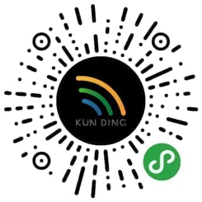
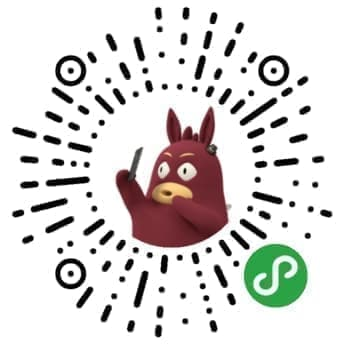
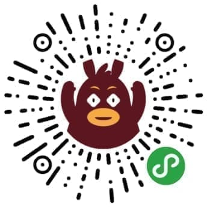

# 存放小程序方面的代码和案例

*有时候 GitHub 不给力，预览用的小程序码出不来，当然是选择原谅它呀。*

---

### 百联中环多肉植物抽奖小程序
* 完成时间：2018.02.07
* 难点：基本无难点
* 文件夹：[wx-zh-plant](https://github.com/foreverZ133/wechat-small-app/tree/master/wx-zh-plant)
* 尚未发布

---

### 青浦奥莱口令红包小程序
* 完成时间：2018.02.06
* 难点：录音功能，权限获取，提现功能
* 文件夹：[wx-qpal-say](https://github.com/foreverZ133/wechat-small-app/tree/master/wx-qpal-say)
* 尚未发布

---

### 电商小程序
* 完成时间：尚未完成
* 难点：自定义组件，商品规格渲染与计算，跳页逻辑与性能
* 文件夹：[wx-kdc-mall](https://github.com/foreverZ133/wechat-small-app/tree/master/wx-kdc-mall)
* 尚未发布

---

### 景观展示小程序
* 完成时间：2018.01.12
* 难点：无难点，静态视频播放而已
* 文件夹：[wx-sw-building](https://github.com/foreverZ133/wechat-small-app/tree/master/wx-sw-building)
* 个人账号无法进行商场服务，因此审核未通过，未发布。

---

### 萌煮辅食打卡小程序
* 完成时间：未完成
* 难点：瀑布流列表，规避频繁跳页，底部菜单组件化
* 文件夹：[wx-mzfs-menu](https://github.com/foreverZ133/wechat-small-app/tree/master/wx-mzfs-menu)
* 萌煮辅食的外包项目，中道崩殂

---

### 青浦奥莱圣诞0元秒杀小程序
* 完成时间：2017.12.16
* 难点：生成图片与保存，复杂的状态管理，卡券的初试水
* 文件夹：[wx-qpal-kill](https://github.com/foreverZ133/wechat-small-app/tree/master/wx-qpal-kill)
* 为青浦奥特莱斯的秒杀活动提供更优的小程序体验，实验了较多小程序功能，跟着学习了一些产品和行业方面的理念。限时活动。

---

### 核销服务小程序
* 完成时间：2017.12.07
* 难点：工具类，全靠接口，无难点
* 文件夹：[wx-kdc-check](https://github.com/foreverZ133/wechat-small-app/tree/master/wx-kdc-check)
* 提供核销卡券奖品等核销服务的小程序，坤鼎KDC公司出品。公司内部使用。

---

### 万物至上门店小程序
* 完成时间：2017.11.17
* 难点：仿制微信门店小程序，无难点
* 文件夹：[wx-wwzs-info](https://github.com/foreverZ133/wechat-small-app/tree/master/wx-wwzs-info)
* 万物至上宠物纪念馆，致力于宠物丧善服务，由于门店小程序选错分类改不了，就让我帮忙做个仿制版的。无预览。

---

### 公司技术部官网
* 完成时间：2017.11.08
* 难点：`<web-view>` 的试坑，具体可见 [博客](https://github.com/foreverZ133/blogs/issues/20)
* 文件夹：[wx-kdcer-it](https://github.com/foreverZ133/wechat-small-app/tree/master/wx-kdcer-it)
* 为 **坤鼎KDC** 官网，包括技术与创意两个部门

---

### 2017上海购物节 - 玩转购物地
* 完成时间：未完成
* 难点：白天黑夜两版样式，较复杂轮播操作，复杂的签到抽奖逻辑
* 文件夹：[wx-sw-2017-scan](https://github.com/foreverZ133/wechat-small-app/tree/master/wx-sw-2017-scan)
* 为2017年上海购物节子活动玩转购物地的预览版

---

### 2017上海购物节 - 全城摇一摇
* 完成时间：2017.10.10
* 难点：图片预加载，复杂 canvas 操作，临时模板效果(后端技术)的试水
* 文件夹：[wx-sw-2017-shake](https://github.com/foreverZ133/wechat-small-app/tree/master/wx-sw-2017-shake)
* 为2017年上海购物节子活动全城摇一摇的预览版

---

### 2017上海购物节（线上主程序）
* 完成时间：2017.08.31
* 难点：图片预加载，时间判断，canvas 序列帧效果，囊括2个子项目，对接线下活动
* 文件夹：[wx-sw-shake](https://github.com/foreverZ133/wechat-small-app/tree/master/wx-sw-shake)
* 活动已下线，可以去看上面两个预览版的

-----
### 2016 玩转购物地，点亮地图小程序
* 完成时间：2017.07.07
* 难点：中奖逻辑，canvas 操作，无法实现刮刮乐
* 文件夹：[wx-sw-2016](https://github.com/foreverZ133/wechat-small-app/tree/master/wx-sw-2016)
* 此为 2016 年项目的 H5 转小程序重构，可预览

-----
### 吉买盛DM小程序
* 完成时间：2017.06.08
* 难点：纵向轮播组件，分页加载轮播项
* 文件夹：[wx-jms-dm](https://github.com/foreverZ133/wechat-small-app/tree/master/wx-jms-dm)
* 无预览。需要食品安全证书，所以未上线。

-----
### 青浦奥特莱斯资讯
* 完成时间：2017.03.16
* 难点：初步摸索，tab 切换与页面跳转，接口请求
* 文件夹：[wx-qpal-news](https://github.com/foreverZ133/wechat-small-app/tree/master/wx-qpal-news)

